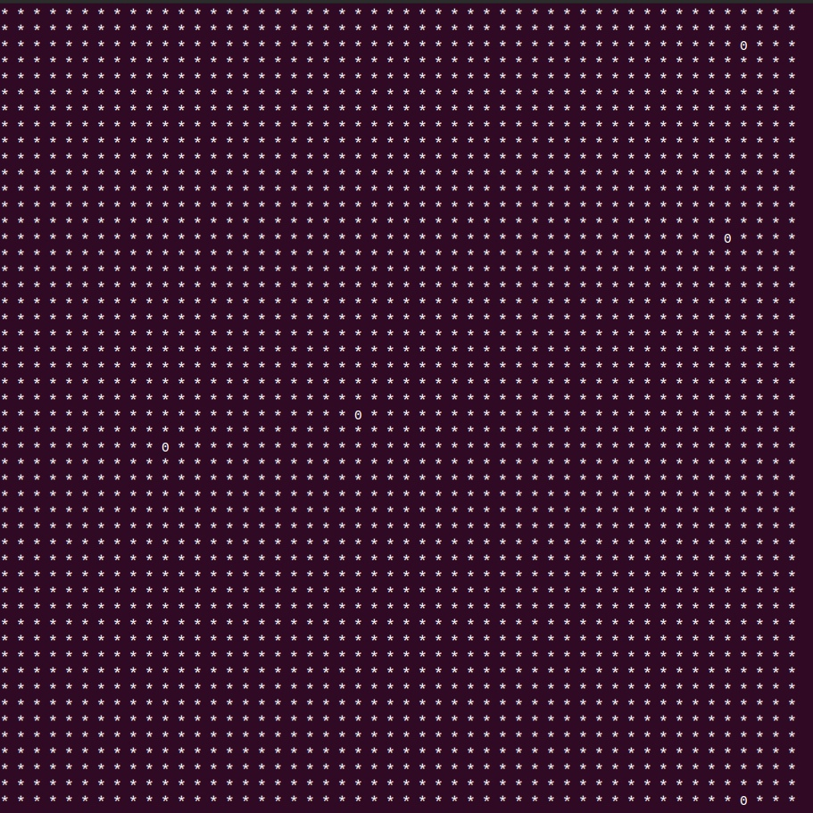
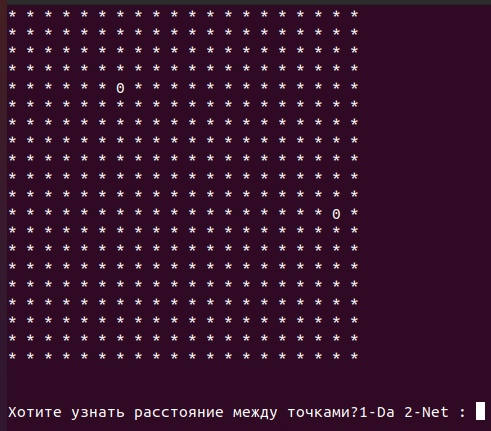

# Лабораторная работа №3.  Преобразование “движущегося объекта” в классы
### Инструкция по запуску 
____
`Внимание!` запуск программы должен осуществлятся в среде Linux тк.
в программе идет работа с консолью, на Windows работать не будет
____
### Описание
Это измененная версия лабораторной **№2**
##### Изменения
Программа переписана с использованием классов


в программе создаются два класса


`Coordinates` в нем присутствуют
- Координата X
- Координата Y

`Object` в нем присутствуют
- id
- массив в котором храняться объекты класса "Coordinates" для хранения истории передвижения
- текущие координаты(объект класса "Coordinates")

так же объекты класса "Object" могут находить пройденное расстояние 


Компиляция программы
```
g++ lab3.cpp -lm -o programm
```
Запуск
```
./programm
```

# Лабораторная работа №2.  Создание движущегося объекта
### Инструкция по запуску 
____
`Внимание!` запуск программы должен осуществлятся в среде Linux тк.
в программе идет работа с консолью, на Windows работать не будет
____
### Описание
В программе создается структура `object` которая хранит в себе 
- id
- массив с текущими координатами
-  двумерный массив, который хранит в себе все пройденные координаты

При запуске программы пользователь может выбрать **масштаб**, с которым будет отображаться поле, лучше всего выбирать **1к20** или **1к50**, иначе поле не поместится на экран, **количество объектов**(`лучше выбирать не большое количество, иначе может произойти коллизия, защиты от коллизии не предусмотренно`) и их **id**. Начальные координаты каждого объекта выбирается рандомно. После ввода всех необходимых данных, в функции `rando` происходит движение объекта.
После чего команда начинает отрисовывать поле и движение объектов(если их несколько). Отрисовывание происходит путем печатания символов `*` , что означает пустую клетку, и символов `0`, что означает наши объекты, команда отрисовывает движение по кадрово, те. отрисовывается один кадр, затем консоль очищается, и отрисовывается уже следующий кадр. 
Перед каждой отрисовкой происходит исскуственная задержка в 1 секунду, что бы было более заметно.

`Внимание!` указывайте небольшое количество ходов, иначе программа будет выполнятся очень долго, так же можно убрать `sleep(1)`, тогда отрисовка будет происходить быстрее(Ctr+z если все таки нужно остановить работу). После отрисовки всех передвижений, команда предложит посчитать расстояние между точками, для этого нужно указать ID каждой точки.(`Защиты от неправильно введенных данных не предусмотрено, так что указывайте и вводите id внимательно`)
Программа будет работать до тех пор, пока пользователь не откажется от поиска расстояния.

Компиляция программы
```
gcc lab2.c -lm -o programm
```
Запуск
```
./programm
```
## Примеры отрисовки полей при разном значении масштаба
### масштаб 20 / количество объектов 4

### масштаб 50 / количество объектов 2
